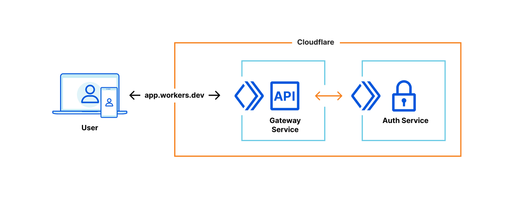

# Composing Workers

<Aside type="warning">

Service bindings are in closed beta currently. Visit [Service Bindings closed beta sign up](https://www.cloudflare.com/en-gb/service-bindings-closed-beta-sign-up/) page to request access.

</Aside>

Service bindings brings composibility into Cloudflare Workers platform. [Worker Services](https://blog.cloudflare.com/introducing-worker-services) are composable, allowing one service to talk to each other. Complex applications running in Workers can be composed from many smaller Services, allowing organisations to structure responsibility into individual teams.

Overall, Service Bindings will allow you to:
- Segment multiple use-cases into separate services that can be explicitly invoked from your code
- Achieve better composability on the Workers platform using service oriented architecture
- Create private microservices, to be conditionally invoked from other edge facing services

--------------------------------

## Composing an example Worker

### Auth service

Following auth service code responds with 200 in case `x-custom-token` request matches `SECRET_TOKEN` secret binding.

```js
export default {
  async fetch(request, env) {
    // Read x-custom-token header and make sure it matches SECRET_TOKEN
    if (request.headers.get("x-custom-token") === env.SECRET_TOKEN) {
      return new Response("Request allowed", { status: 200 });
    } else {
      return new Response("x-custom-token does not match, request not allowed", { status: 403 })
    }
  }
}
```

This auth service does not need to have workers.dev or custom domain public endpoint, it will accessed through a service binding from the other service script directly.

### App service and bindings usage


In order to bind and call auth service above, the app service needs to setup a service binding. You can manage service bindings in `Settings -> Variables` under the Workers Service settings.


Once added, app service can access the service binding directly from the code, as in example below.

<Aside type="note">

Service bindings are supported in the module syntax only.

</Aside>

```js
export default {
  async fetch(request, env) {
    // Fetch AUTH service and pass request
    const response = await env.AUTH.fetch(request);

    // Return response from the AUTH service if the response status is not 200
    // It would return 403 'x-custom-token does not match, request not allowed' response in such case
    if (response.status !== 200) {
      return response;
    }

    // Request allowed
    const data = "" // For example, read data from KV, Durable Objects, or Database
    return new Response(data);
  }
}
```

In this setup, only the app service is exposed to the internet, and talking to the auth service over a _(private)_ service binding.


